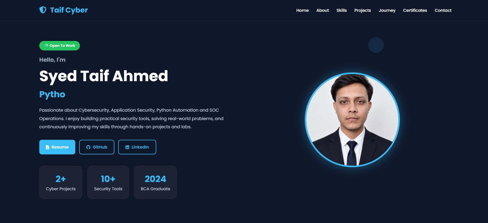
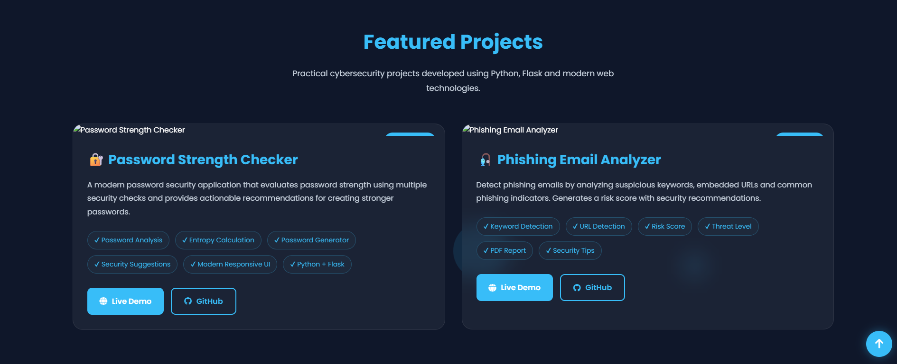
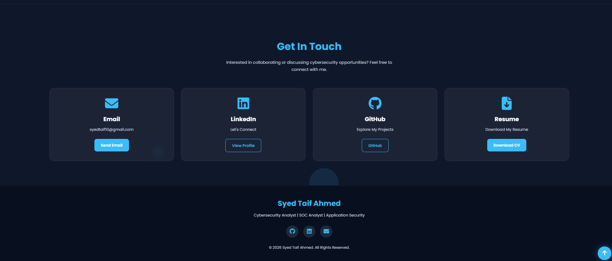

<h1 align="center">🛡️ Cybersecurity Portfolio</h1>

<p align="center">
A modern cybersecurity portfolio built with Python & Flask to showcase cybersecurity projects, technical skills, certifications, and hands-on learning in a clean, responsive interface.
</p>

<p align="center">

<a href="https://python.org">

</a>

<a href="https://flask.palletsprojects.com/">

</a>

<a href="https://cyber-portfolio-ugxb.onrender.com">

</a>

<a href="LICENSE">

</a>

</p>

---

# 📌 Overview

Cybersecurity Portfolio is a modern portfolio website developed using **Python** and **Flask** to showcase cybersecurity projects, technical skills, certifications, and practical learning.

The portfolio serves as a central hub where recruiters and cybersecurity professionals can explore my work, projects, GitHub repositories, and professional profile.

---

# ✨ Features

- ✅ Responsive Portfolio Design
- ✅ Modern Cybersecurity User Interface
- ✅ About Me Section
- ✅ Technical Skills Showcase
- ✅ Featured Cybersecurity Projects
- ✅ Certifications Section
- ✅ Resume Download
- ✅ Contact Information
- ✅ GitHub & LinkedIn Integration
- ✅ Built using Python & Flask

---

# 📸 Screenshots

## 🏠 Home Page



---

## 💼 Projects Section



---

## 📞 Contact Section



---

# 🛠️ Tech Stack

- Python
- Flask
- HTML5
- CSS3
- JavaScript

---

# 📚 Learning Focus

- Security Operations Center (SOC)
- Application Security
- Linux
- Networking
- Python Automation
- OWASP Top 10
- Git & GitHub
- TryHackMe Labs

---

# 📂 Featured Projects

## 🔐 Password Strength Checker v2.5

A Flask-based password security application that evaluates password strength using multiple security rules and provides recommendations for creating stronger passwords.

### Features

- Password Strength Analysis
- Password Entropy
- Password Generator
- Security Recommendations
- Modern Responsive UI

---

## 🎣 Phishing Email Analyzer v2.1

A cybersecurity tool that analyzes email content to detect phishing indicators by checking suspicious keywords, malicious URLs, and generating a phishing risk score.

### Features

- Suspicious Keyword Detection
- URL Detection
- Risk Score Calculation
- Threat Classification
- PDF Report Generation
- Security Recommendations

---

## 🛡️ Cybersecurity Portfolio

A modern personal portfolio developed with Flask to showcase cybersecurity skills, projects, certifications, and professional information.

### Features

- Responsive Design
- Cybersecurity Theme
- Resume Download
- Project Showcase
- Contact Section
- GitHub Integration

---

# 📂 Project Structure

```text
Cyber-Portfolio/
│
├── app.py
├── requirements.txt
├── README.md
├── LICENSE
├── .gitignore
│
├── templates/
│   └── index.html
│
├── static/
│   ├── style.css
│   ├── script.js
│   ├── profile.jpg
│   ├── password.png
│   ├── phishing.png
│   ├── resume.pdf
│   └── favicon.ico
│
└── screenshots/
    ├── home.png
    ├── projects.png
    └── contact.png
```

---

# ⚙️ Installation

## Clone Repository

```bash
git clone https://github.com/SyedTaif/Cyber-Portfolio.git
```

## Go to Project Folder

```bash
cd Cyber-Portfolio
```

## Install Dependencies

```bash
pip install -r requirements.txt
```

## Run Application

```bash
python app.py
```

## Open Browser

```
http://127.0.0.1:5000
```

---

# 🚀 Live Demo

🌐 https://cyber-portfolio-ugxb.onrender.com

---

# 🎯 Skills Highlighted

- Python
- Flask
- HTML
- CSS
- JavaScript
- Linux
- Networking
- Git & GitHub
- Cybersecurity Fundamentals
- OWASP Top 10
- TryHackMe

---

# 🔮 Future Improvements

- GitHub Statistics
- TryHackMe Badge Integration
- Hack The Box Badge
- Blog Section
- Contact Form
- Project Filtering
- Admin Dashboard

---

# 👨‍💻 Author

**Syed Taif Ahmed**

🌐 GitHub  
https://github.com/SyedTaif

💼 LinkedIn  
https://www.linkedin.com/in/syed-taif-ahmed-ba8a683bb/

🌍 Portfolio  
https://cyber-portfolio-ugxb.onrender.com

---

# ⭐ Support

If you found this project useful, please consider giving it a ⭐ on GitHub.

It helps others discover the project and motivates future improvements.

---

<p align="center">

Made with ❤️ using Python, Flask & Cybersecurity

</p>
